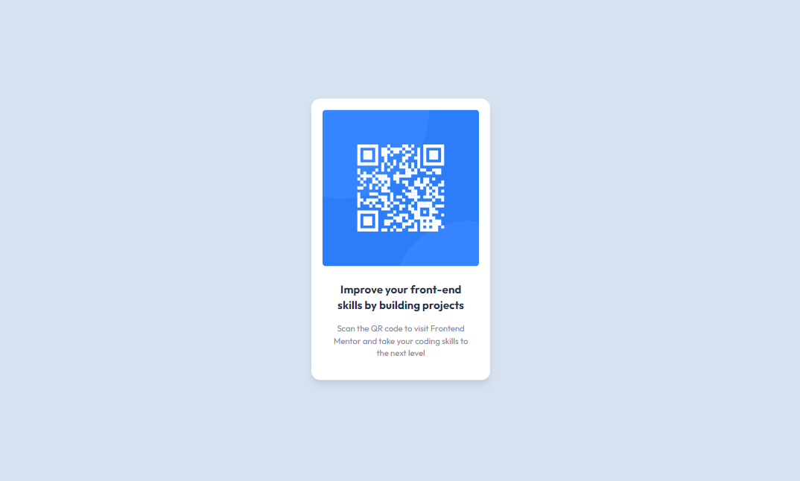
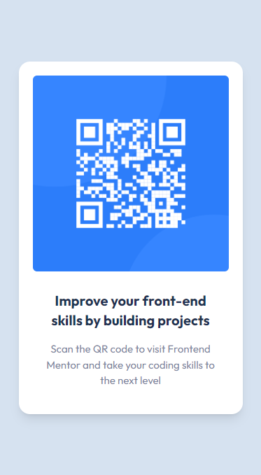

# Frontend Mentor - QR code component solution

This is a solution to the [QR code component challenge on Frontend Mentor](https://www.frontendmentor.io/challenges/qr-code-component-iux_sIO_H)

## Table of contents

- [Screenshot](#screenshot)
- [Links](#links)
- [My process](#my-process)
  - [Built with](#built-with)
  - [What I learned](#what-i-learned)
  - [Continued development](#continued-development)
- [Author](#author)

### Screenshot

### Links

- Solution URL: [Add solution URL here](https://your-solution-url.com)
- Live Site URL: [Add live site URL here](https://your-live-site-url.com)

## My process

Since I don't have the premium version yet I tried to respect the actual format but without exact width/padding etc I have used my personal judgment in order to be the more accurate possible. I have first create a parent container to place the card on the middle of the screen, after that I've created another container this time to create the card with the image and the text, align all that with the flex positioning properties, add some padding and the font and It was all.

### Built with

- Semantic HTML5 markup
- Flexbox
- Mobile-first workflow
- [React](https://reactjs.org/) - JS library
- Tailwindcss- For styles

### What I learned

It is the first time I used Vitejs even if I know that was not really useful here but that helps me getting started with this.

### Continued development

I think it's important to improve my knowledge with responsive devices because I think before even writing any code you need to already have an idea of how optimized the code in order to be either for a mobile or big screen version.

## Author

- Website - [Adjadi Axel]
- Frontend Mentor - [@ADJADI](https://www.frontendmentor.io/profile/ADJADI)
